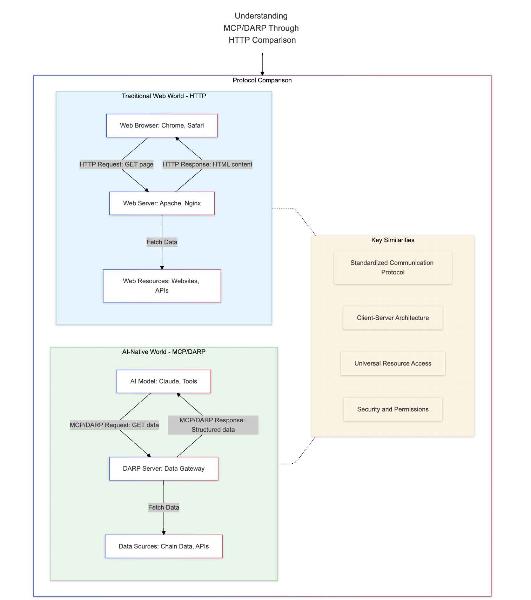

# DARP - Decentralized Agent and Resource Protocol 

  

  <strong>🚀 A Web3-native protocol revolutionizing AI agent communication and blockchain data access, powered by MCP</strong>

  <a href="https://highkey.ai">🌍 Website</a> |
  <a href="https://docs.highkey.ai/">📚 Documentation</a> |
  <a href="https://x.com/highkey_ai">🐦 Twitter/X</a>

## 🌟 Introduction

### 🤔 What is DARP?

DARP (Decentralized Agent and Resource Protocol) is a groundbreaking protocol built upon Anthropic's innovative Model Context Protocol (MCP). It seamlessly bridges the gap between AI and Web3, establishing a standardized framework for data access and agent communication within the blockchain ecosystem.

✨ Special thanks to Anthropic and the community for the foundational MCP protocol that made DARP possible.

  

## 🚀 Getting Started

-  [🌍 Website](https://highkey.ai)  

-  [📚 Documentation](https://docs.highkey.ai) 

-  [🐦 Twitter/X](https://x.com/highkey_ai) 

## 🛠️ DARP Server Projects 
- [💼 WalletAnalysis_DarpServer](https://github.com/DARPAI/WalletAnalysis_DarpServer) - Comprehensive wallet analysis engine
- [📊 Boltrade_DarpServer](https://github.com/DARPAI/Boltrade_DarpServer) - Advanced trading analytics
- [📈 Coinmarketcap_DarpServer](https://github.com/DARPAI/Coinmarketcap_DarpServer) - Real-time market data integration
- [⛓️ MultiChains_DarpServer](https://github.com/DARPAI/MultiChains_DarpServer) - Cross-chain data orchestration
- [🔍 Search1api_DarpServer](https://github.com/DARPAI/Search1api_DarpServer) - Enhanced blockchain search capabilities
- [📡 Solscan_DarpServer](https://github.com/DARPAI/Solscan_DarpServer) - Solana ecosystem analytics

 🔮 More innovative DARP Servers coming soon...

## 🤝 Contributing

We enthusiastically welcome contributions of all kinds! Whether you're fixing bugs 🐛, improving documentation 📝, or proposing exciting new features ✨.

💭 Have questions? Join the vibrant discussion in our [community forum](https://github.com/orgs/DARPAI/discussions).

## ℹ️ About

DARP is an open-source project created by [HighKey](https://highkey.ai), extending the Model Context Protocol to empower the next generation of Web3 applications. 
